<p align="center">
  
</p>

<h1 align="center">AgentCLI</h1>

<p align="center">
  <strong>把事情交给数字员工，而不是学习一套开发工具。</strong><br/>
  在一个本地优先的个人助手客户端里，分配任务、补充要求、检查交付并归档成果。<br/>
  <sub>Your local-first AI assistant client — assign work, review results, keep the deliverables.</sub>
</p>

<p align="center">
  <a href="https://www.npmjs.com/package/@yancyyu/agentcli"></a>
  <a href="https://www.npmjs.com/package/@yancyyu/agentcli"></a>
  <a href="LICENSE"></a>
  
</p>

<p align="center">
  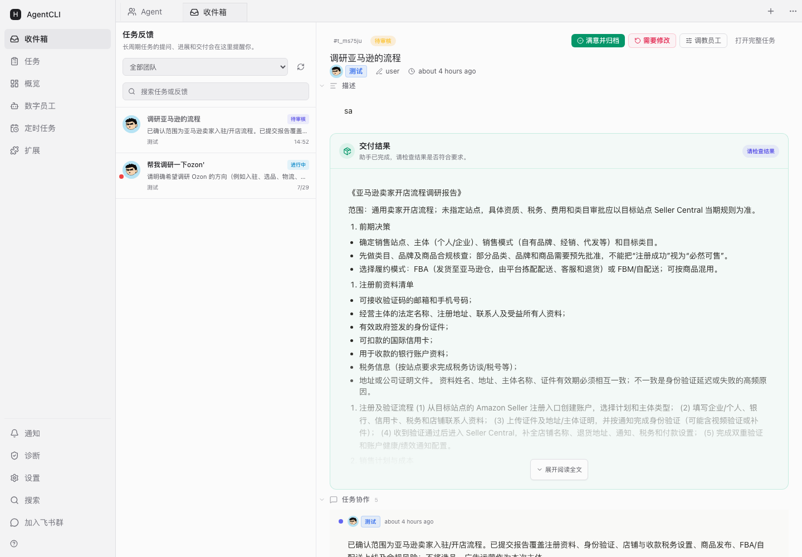
</p>

<p align="center">
  <strong>任务反馈集中处理</strong> · <strong>交付结果直接阅读</strong> · <strong>满意后一键归档</strong> · <strong>长期调教数字员工</strong>
</p>

---

## 这是什么

AgentCLI 是一个面向普通用户的**本地 AI 数字员工客户端**。你不需要理解命令行、API、会话或运行时：只要像给同事交代工作一样创建任务，数字员工会在需要补充、提交结果或遇到问题时回到收件箱提醒你。

交付报告会直接显示在任务里，图片可以预览，文件可以打开。满意后点击“满意并归档”，正式成果会按版本保存到数字员工的本地 `outputs` 目录；如果不满意，直接提出修改意见，原任务会继续返工，不会产生混乱的新任务。

> **Web for humans, CLI for agents.** 普通用户只需要工作台；CLI、HTTP API 和任务总线留在底层，为数字员工、自动化和高级用户提供能力。

### 一次完整的工作流程

1. **创建任务**：选择数字员工，用自然语言说明要完成什么；也可以直接附上图片、PDF、文本或 Office 文件。
2. **在收件箱协作**：补充要求、回答问题，回复始终属于当前任务。
3. **检查交付结果**：直接阅读报告、预览图片和相关文件，不必翻执行日志。
4. **确认或返工**：满意就归档；需要调整就在原任务上继续修改。

本地参考文件会按任务隔离复制到数字员工当前项目的 `input/<任务ID>/` 目录，执行者会先读取这些输入；正式成果则继续按版本归档到 `outputs`，输入和输出不会混在一起。

需要多人协作时，可以创建“协作团队”并选择成员。页面采用扁平结构：团队在顶部切换，历史任务横向浏览，不再叠加“团队侧栏 → 任务侧栏”。每次任务开始前，成员会通过结构化圆桌自行推选本任务队长，再由队长分工、验收、整合并统一交付。

### 解决的问题

- 不再需要在聊天记录、终端窗口和文件夹之间寻找任务进展
- 不再把“当前任务回复”“长期调教”和“新建后续任务”混为一谈
- 不再出现已有交付结果却仍显示“进行中”的状态冲突
- 不再让成果只停留在聊天里：确认后自动归档，并保留历史版本

---

## 产品界面

### 核心工作流

<table>
  <tr>
    <td width="50%"><strong>任务反馈收件箱</strong><br/><sub>只展示需要你关注的提问、进展和交付。</sub><br/>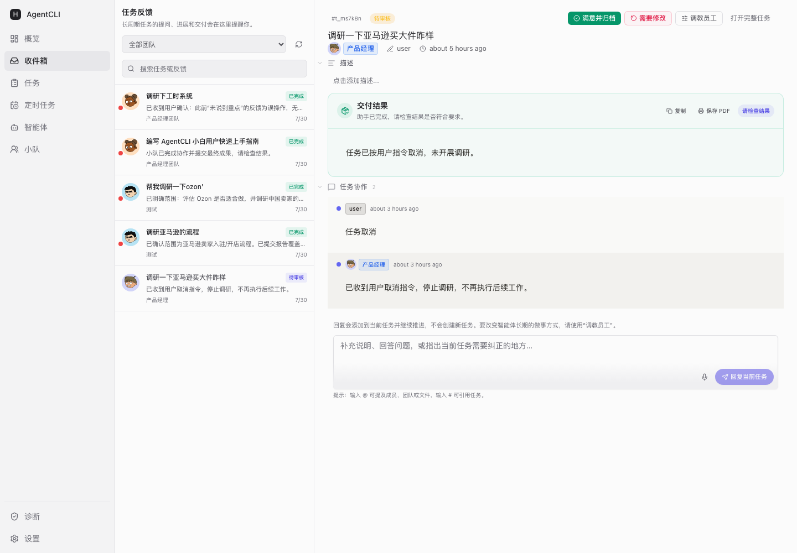</td>
    <td width="50%"><strong>交付结果审核</strong><br/><sub>报告直接阅读，满意归档，不满意原任务返工。</sub><br/></td>
  </tr>
  <tr>
    <td width="50%"><strong>简洁任务列表</strong><br/><sub>按进行中、待审核和已完成组织工作。</sub><br/>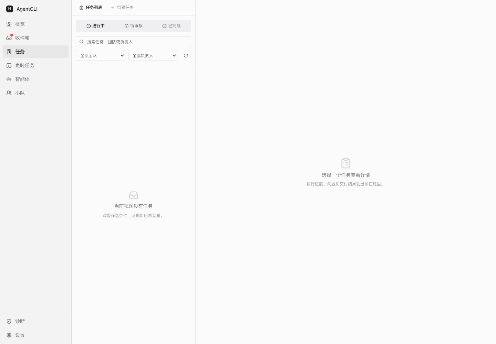</td>
    <td width="50%"><strong>创建任务</strong><br/><sub>选员工、说清结果，并直接附上本地参考文件。</sub><br/>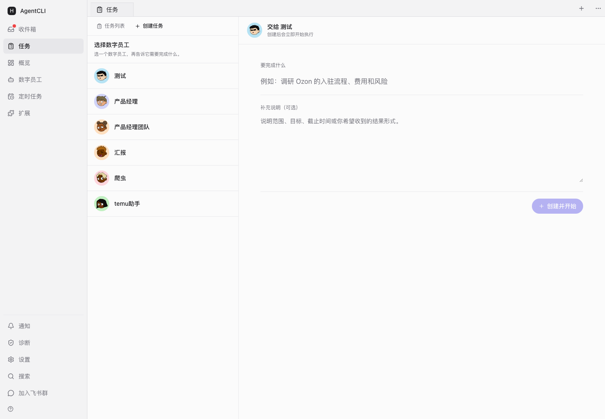</td>
  </tr>
  <tr>
    <td width="50%"><strong>数字员工</strong><br/><sub>统一查看员工状态、负责项目和最近活动。</sub><br/>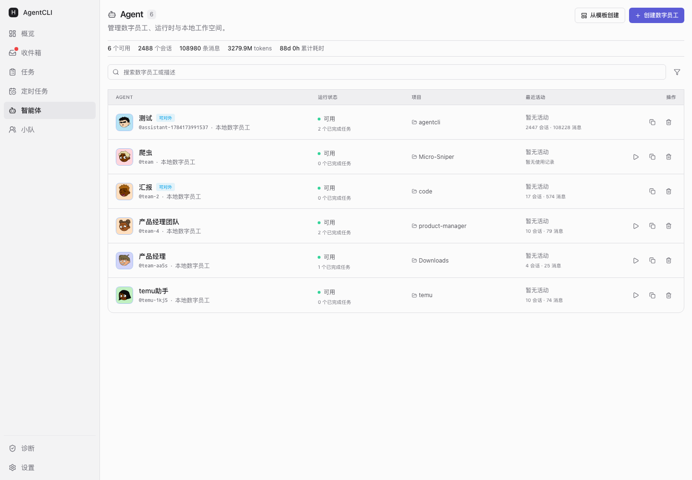</td>
    <td width="50%"><strong>概览</strong><br/><sub>快速了解本地数字员工的整体工作情况。</sub><br/>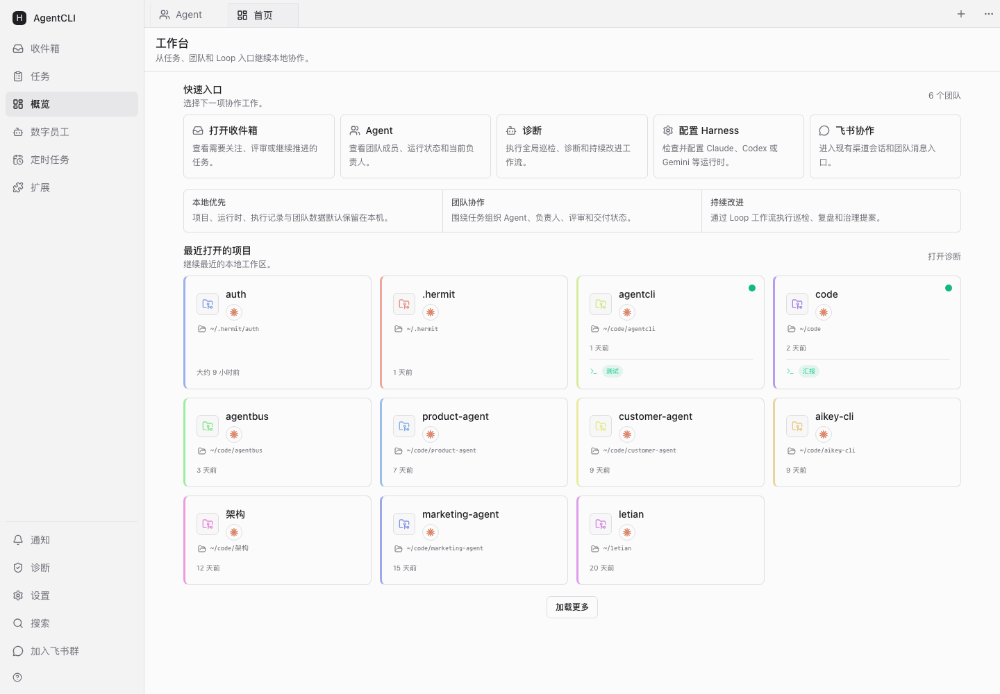</td>
  </tr>
</table>

### 协作方式

<table>
  <tr>
    <td width="50%"><strong>调教员工</strong><br/><sub>改变长期做事方式，不创建任务。</sub><br/>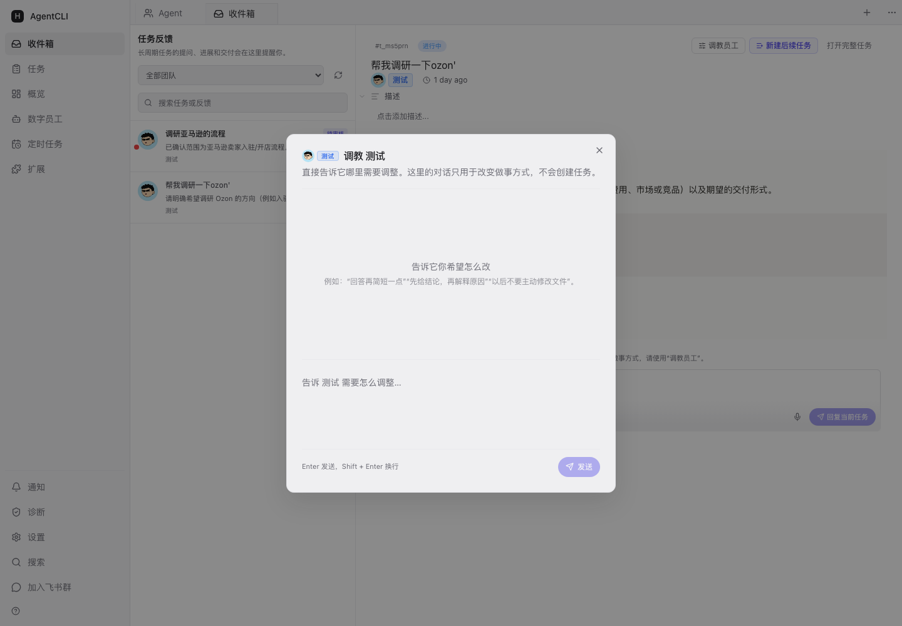</td>
    <td width="50%"><strong>新建后续任务</strong><br/><sub>保留来源关系，把新目标交给合适的员工。</sub><br/>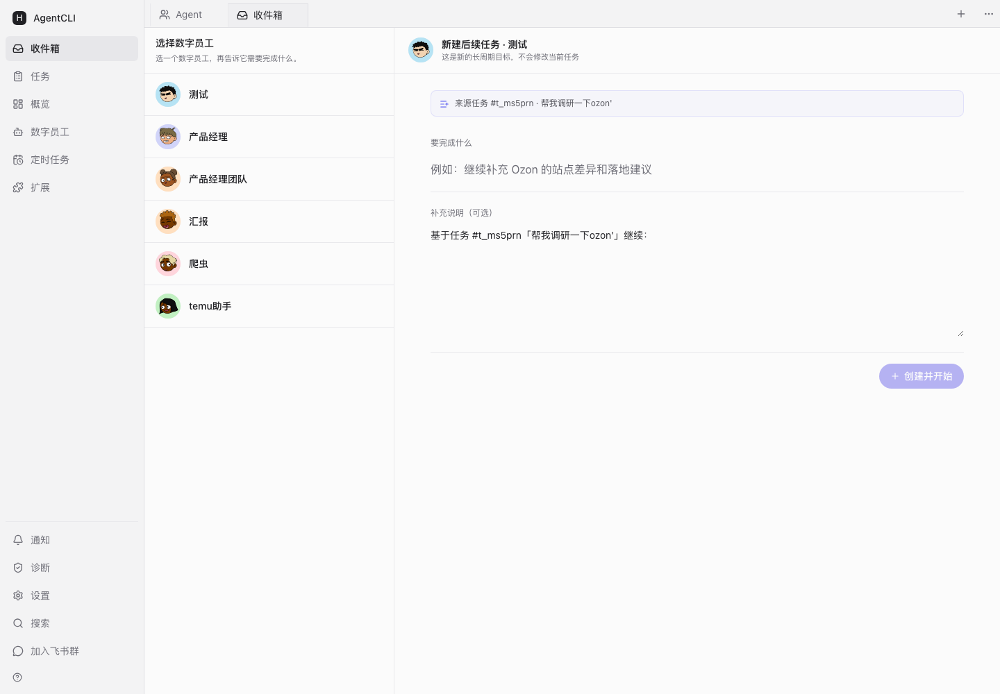</td>
  </tr>
</table>

<details>
<summary><strong>查看定时任务、扩展、通知、诊断和设置页面</strong></summary>

<br/>

| 功能页面 | 截图                                                                                             |
| :------- | :----------------------------------------------------------------------------------------------- |
| 定时任务 | 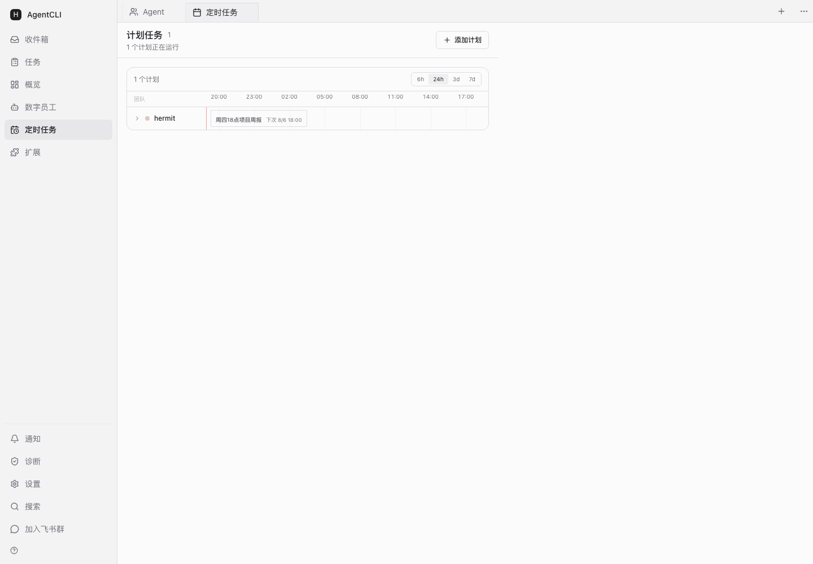    |
| 扩展能力 | 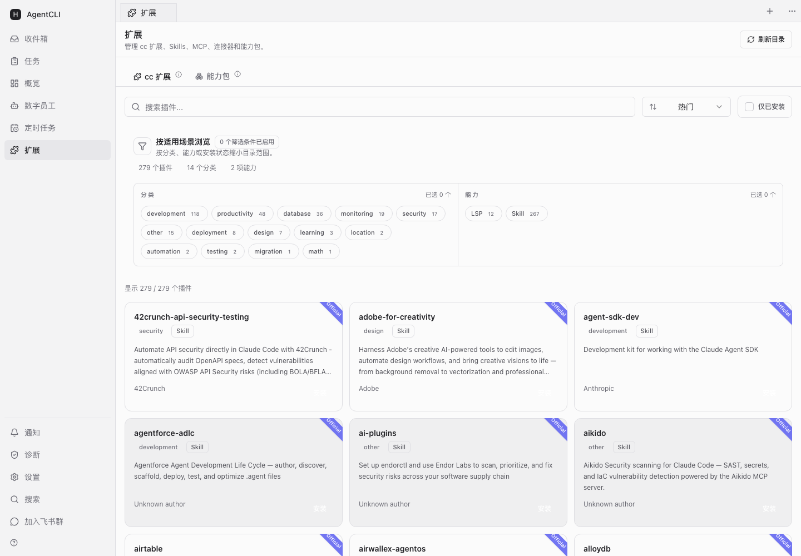 |
| 通知     | 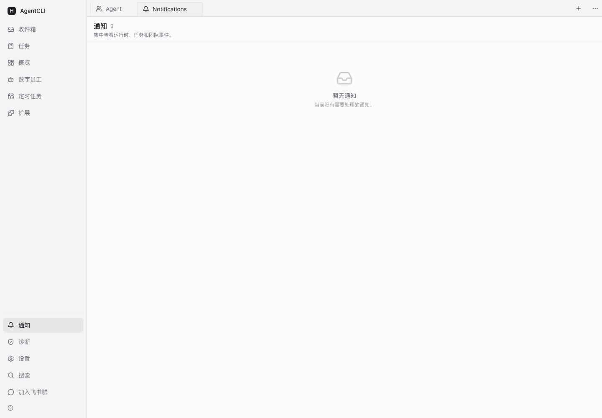    |
| 系统诊断 | 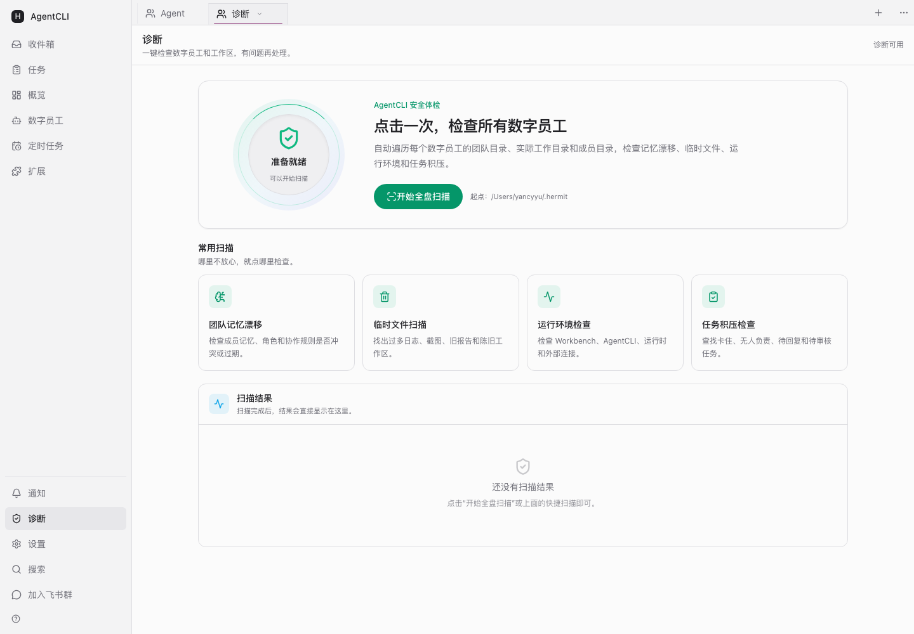  |
| 设置     | 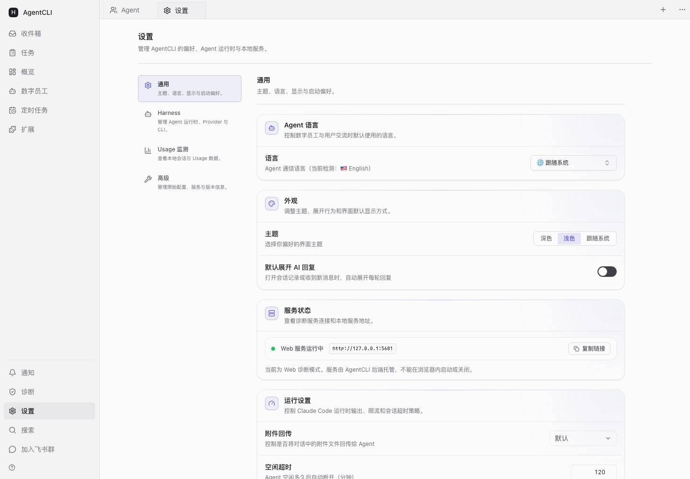         |

</details>

---

## 两个产品，一条路径

先把本机 AI 运行时管起来，需要团队化时再接入 AgentBus。

| 产品         | 定位                                                  | 适用场景                                       |
| :----------- | :---------------------------------------------------- | :--------------------------------------------- |
| **AgentCLI** | 本地优先的 CLI + Web 工作台。你现在就能装、立刻能用。 | 单机使用、脚本化、自动化、本地数字员工团队     |
| **AgentBus** | 中心化数据总线，把单机工具升级成团队 / 企业平台。     | 多人 / 多团队协作、IM 触发任务、企业级用量看板 |

> 关系一句话：**AgentCLI 是本地操作面，AgentBus 是协调骨干。** 不接 Bus = 单机模式，照样完整能跑；接入 Bus 才解锁多人协作与企业能力。

---

## 30 秒快速体验

**一行安装（自带 Node 运行时，无需额外装环境）：**

```bash
# Windows（PowerShell）
irm https://yancyuu.github.io/agentcli/install.ps1 | iex

# macOS / Linux
curl -fsSL https://yancyuu.github.io/agentcli/install.sh | bash
```

装完**开一个新终端**运行 `agentcli`，浏览器打开 [http://127.0.0.1:5680](http://127.0.0.1:5680) 创建你的第一个数字员工团队。

<details>
<summary>或者用 npm / npx（适合已装 Node 的开发者）</summary>

```bash
# 免安装直接运行
npx @yancyyu/agentcli@latest init

# 或全局安装
npm install -g @yancyyu/agentcli@latest
agentcli
```

</details>

---

## 🤖 给 Agent 的最小上手路径（说明书）

> 把这段交给一个 AI agent，它能照着装好、登录、上报、自检。完整在线说明书：<https://yancyuu.github.io/agentcli/>，也可以直接把这个链接丢给 Claude Code / Codex。

```bash
# 1. 安装（三选一）
npm install -g @yancyyu/agentcli@latest      # 或 npx @yancyyu/agentcli@latest
agentcli init                                 # ✅ 快速启动 Web + 用量后台 worker

# 2. 登录上报目标（飞书授权绑定 AgentBus）
agentcli auth login
agentcli auth status                          # ✅ 成功标志：已登录

# 3. 立即扫描并增量上报一次（验证链路）
agentcli usage report                         # ✅ 成功标志：上报计数 > 0；--full 补报历史

# 4. 核对状态
agentcli status                               # daemon / worker 运行中
agentcli usage today                          # 今日本地用量摘要（不上传）
```

> ⚠️ 自动上报需要**三要素同时满足**：已登录 + 消息上报已开启 + 后台采集运行中。「消息上报」开关只在交互菜单或 Web 里（`agentcli` →「用量同步」→「消息上报」），没有单独子命令——这是刻意设计。

---

## CLI 命令速查

所有命令支持 `--json` 输出机器可读结果（适合 agent / 脚本调用）。不带参数运行 `agentcli` 进入终端导航。

### 启动与状态

| 命令                            | 说明                                                                                   |
| :------------------------------ | :------------------------------------------------------------------------------------- |
| `agentcli`                      | 打开终端导航（控制面菜单）：工作台、用量同步、用户、token 池(beta)                     |
| Web 工作台「创建数字员工」      | 运行 `agentcli web` 后在浏览器中创建和管理数字员工；终端工作台菜单不再提供快速创建入口 |
| `agentcli init`                 | 快速初始化：默认启动 Web 工作台 + 用量后台 worker（worker 默认开机自启）               |
| `agentcli web`                  | 直接启动 Web 工作台（默认 127.0.0.1:5680）；加 `--daemon` 后台运行                     |
| `agentcli --daemon --port 8080` | 后台运行并指定端口                                                                     |
| `agentcli status`               | 查看后台 daemon / Web 运行状态                                                         |
| `agentcli doctor`               | 只读本地诊断：配置、服务、路径                                                         |
| `agentcli stop`                 | 显示停止指引（不会主动关闭 Web / 用量 worker）                                         |
| `agentcli restart`              | 重启 Web daemon + 用量 worker（更新或改配置后用它让新代码生效；本地命令，免登录）      |

### 用户授权（上报前提）

| 命令                   | 说明                                          |
| :--------------------- | :-------------------------------------------- |
| `agentcli auth status` | 查看 AgentBus 用户授权状态                    |
| `agentcli auth login`  | 飞书授权登录 AgentBus；登录后用量才有上报目标 |
| `agentcli auth logout` | 退出 AgentBus 用户（不影响本地 runtime 登录） |

### 用量采集与上报

| 命令                                               | 说明                                                      |
| :------------------------------------------------- | :-------------------------------------------------------- |
| `agentcli usage status`                            | 后台 worker 是否运行、消息上报是否开启、上报运行时        |
| `agentcli usage today`                             | 查看今日本地 usage 摘要（不上传）                         |
| `agentcli usage start`                             | 开启轻量后台采集，默认配置开机自启；仅扫描本机 JSONL      |
| `agentcli usage stop`                              | 停止后台采集（默认关闭开机自启，`--keep-autostart` 保留） |
| `agentcli usage report`                            | 立即扫描并按服务端游标增量上报；`--full` 全量重扫补传历史 |
| `agentcli usage autostart status\|enable\|disable` | 管理开机自启（macOS launchd）                             |

### 团队 / 任务 / 维护

| 命令                             | 说明                                                                              |
| :------------------------------- | :-------------------------------------------------------------------------------- |
| `agentcli teams list`            | 列出本地团队（不启动 Web）                                                        |
| `agentcli teams create`          | 创建本地团队元数据；支持 `--name` / `--harness` / `--bind-project` / `--work-dir` |
| `agentcli tasks list --team <t>` | 查看某团队活跃任务                                                                |
| `agentcli update`                | 检查并自更新到最新版本                                                            |
| `agentcli add <plugin>`          | 安装能力插件到 MCP library（例：`add worker-society`）                            |

### 在 Web 工作台创建数字员工

终端工作台菜单不再提供「开通数字员工」快捷向导。请运行：

```bash
agentcli web
```

浏览器打开 `http://127.0.0.1:5680` 后，在 Web 工作台使用「创建数字员工」完成创建、运行时选择和后续管理。底层 `create-digital-worker` 命令暂时保留，以兼容已有脚本和自动化流程。

---

## ⚙️ 配置 AI 运行时（客户端配置）

### 本机数据来源

AgentCLI 无侵入扫描本地会话日志：

| 运行时      | 数据位置                        | 采集内容                                 |
| :---------- | :------------------------------ | :--------------------------------------- |
| Claude Code | `~/.claude/projects/**/*.jsonl` | token 用量、会话数、消息量；支持 IM 归因 |
| Codex       | `~/.codex/sessions/**/*.jsonl`  | token 用量（output_tokens 为主）         |

### 把网关 Key 写进 Claude / Codex（token 池认领）

登录后，在终端菜单 `agentcli` →「**token 池(测试版)**」→「**认领**」，会自动签发一个一次性网关 key。你可以选择写入 **Codex**、**Claude Code** 或两者；默认选择 Codex。认领后会直写本地运行时配置，并同步写入系统环境变量：

- **Claude Code** `~/.claude/settings.json`：写入网关 endpoint（`ANTHROPIC_BASE_URL`）+ `ANTHROPIC_AUTH_TOKEN`，deep-merge 保留其它键，**不固定模型**。
- **Codex** `~/.codex/auth.json`（`OPENAI_API_KEY`）+ `~/.codex/config.toml`（surgical 改写 `model_provider` / `model` / wire_api 与 `[model_providers.*]`，**保留 `[projects.*]`**）。Codex 的 base_url 由网关 `proxyPaths` 按所选 wire_api 解析，与 Claude 的 endpoint 不同。
- 同时写 `~/.hermit/aikey.env`（0600），作为已认领标记，并供外部 agent 手动 `source`。
- **系统环境变量**：认领时会一次性更新环境变量，不安装 `precmd` / `PROMPT_COMMAND` 等每次提示符执行的 hook：
  - **macOS**：更新 `~/.zshrc` 的 AgentCLI 管理块，并通过 `launchctl setenv` 让当前登录会话中新启动的 GUI 应用可读取；已有终端请新开一个。
  - **Linux**：更新 `~/.bashrc` 的 AgentCLI 管理块；新开终端后生效。
  - **Windows**：写入当前用户的 Windows 环境变量；新开终端后生效。
  - Claude Code 使用 `ANTHROPIC_AUTH_TOKEN` / `ANTHROPIC_BASE_URL`；Codex 使用 `OPENAI_API_KEY` / `OPENAI_BASE_URL`。只写入你在认领时选择的运行时对应变量。

> 🔒 首次写入前自动把你的**原始** Claude/Codex 配置快照到 `~/.hermit/agentcli.env.bak`（**只创建一次**，后续认领永不覆盖）。在「token 池 → **一键恢复原始配置**」可随时还原：原本存在的文件回到原内容，token 池新建的文件会被删除，无残留。检查快照时会自动修正旧版本遗留的备份路径记录，跨 1.9.8 / 1.9.9 升级后仍能准确恢复。认领到的 key 是**即焚明文**，不落库、不回显明文。该能力需服务端授权开通（部分账户暂未开放）。

---

## 默认路径与端口

| 项目             | 默认值                        | 说明                         |
| :--------------- | :---------------------------- | :--------------------------- |
| Web UI           | `http://127.0.0.1:5680/teams` | 团队工作台入口               |
| 本地状态         | `~/.hermit/`                  | 团队、任务、消息、设置、审计 |
| Claude Code 会话 | `~/.claude/projects`          | 用量和会话数据来源           |
| Codex 会话       | `~/.codex/sessions`           | Codex 用量数据来源           |

---

## 支持的 AI 运行时

| 一等适配                                         | 兼容注册                             |
| :----------------------------------------------- | :----------------------------------- |
| Claude Code, Codex, Gemini CLI, Cursor, OpenCode | Devin, Qoder, Kimi, iFlow, ACP, tmux |

---

## 架构

```text
开发者本地
  Claude Code / Codex / Cursor / Gemini / OpenCode ...
        ↓ 会话日志 & token 用量
  AgentCLI  (本地 CLI + Web 工作台)
        ↓ 统一上报
  AgentBus (企业版 · 中心化数据总线)
        ↓ 看板 & 协作
  企业管理者 / 团队成员
```

| 组件                 | 是什么                                                                                                    | 怎么启动                                   |
| :------------------- | :-------------------------------------------------------------------------------------------------------- | :----------------------------------------- |
| **CLI** (`agentcli`) | 终端控制面。交互式导航菜单 + 全部子命令。                                                                 | `agentcli` 进菜单，或 `agentcli <command>` |
| **Web 工作台**       | 本地浏览器面板。团队、看板、运行时、用量、代码评审。                                                      | `agentcli web` / `agentcli --daemon`       |
| **Bus（团队总线）**  | 协调骨干。团队元数据、IM→团队路由、任务池、跨团队派发、审计、用量收敛。由独立商业项目 **agentbus** 提供。 | 企业版：`agentcli auth login` 接入         |

> CLI 和 Web 都是 Bus 的操作面——CLI 适合命令行与自动化，Web 适合可视化；两者读写同一份本地数据。

---

## 截图

<details>
<summary>展开查看更多截图</summary>

<table>
  <tr>
    <td align="center"><b>团队列表</b></td>
    <td align="center"><b>团队工作区</b></td>
  </tr>
  <tr>
    <td></td>
    <td></td>
  </tr>
  <tr>
    <td align="center"><b>任务看板</b></td>
    <td align="center"><b>运行时设置</b></td>
  </tr>
  <tr>
    <td></td>
    <td></td>
  </tr>
</table>

</details>

---

## 更新 AgentCLI

> **1.9.34+ 起**：更新会顺带修复 cc-connect 二进制下载问题（国内 / 企业防火墙环境下原本会静默失败，导致「同步到运行时失败：fetch failed」）。cc-connect 安装走镜像、启动时自愈下载，无需手动处理。遇到 fetch failed 的用户升级到最新版即可。

更新前先停止会加载全局安装目录文件的进程，避免 Windows `EBUSY`，也避免旧 worker 在更新后继续运行旧代码：

```bash
# 1. 停用量 worker
agentcli usage stop

# 2. 停 Web daemon；它托管的 cc-connect / hermit-bridge 也会随之退出
agentcli services stop web

# 3. 安装最新版
npm install -g @yancyyu/agentcli@latest --prefer-online

# 4. 恢复 Web + 用量 worker
agentcli init

# 5. 验证
agentcli --version
agentcli status
agentcli usage status
agentcli doctor
```

注意：

- 裸 `agentcli stop` **只显示停止指引**，不会停止 Web daemon 或用量 worker。
- 协作服务是配置项，不是独立本地进程，无需为了更新单独停止。
- `agentcli update` 是内置自更新：**免登录**（本地生命周期命令），且固定走官方 `registry.npmjs.org`——避免默认镜像（如 npmmirror）同步延迟导致装到旧版或 `ETARGET`。它会在成功后热重载用量 worker，但**不重启 Web daemon**；更新后跑一次 `agentcli restart` 让 Web daemon / hermit-bridge / cc-connect 也切到新代码。Windows 若遇到文件锁，使用上面的完整手动流程。
- 停止服务和更新包不会删除 `~/.hermit/` 中的团队、渠道配置、登录态或用量状态。
- 若仍提示文件被占用，只终止与 agentcli / hermit / cc-connect 明确相关的残留进程，不要批量结束所有 Node 进程。

完整说明见 [在线指南 · 安全更新 AgentCLI](https://yancyuu.github.io/agentcli/#update)。

---

## 常见问题

<details>
<summary><b>「同步到运行时失败：fetch failed」/ cc-connect 未就绪</b></summary>

这是 cc-connect（hermit-bridge 的底层运行时）的二进制没装上造成的。cc-connect 的二进制会从 GitHub Releases 下载，国内 / 企业防火墙环境下经常失败，而它又是可选依赖，npm 会静默跳过，导致工作台能开但团队配置、消息收发全不可用。

**1.9.34+ 已内置自动修复**：安装时走镜像、启动时自愈下载、顶部横幅提示。

升级到最新版即可自动解决：

```bash
agentcli services stop web
npm install -g @yancyyu/agentcli@latest --prefer-online
agentcli services start web
```

升级后重开工作台，cc-connect 会自动从镜像（`gh-proxy.com` / `ghproxy.net`）下载到 `~/.hermit/cc-connect-bin/`。

**临时手动修复**（无法升级时）：

```bash
# 1. 看端口有没有监听（9820 / 9810）
netstat -ano | findstr "9820 9810"   # Windows
lsof -i :9820                        # macOS

# 2. 直接装 cc-connect，走镜像
npm install -g cc-connect
# 或强制指定镜像前缀
CC_CONNECT_MIRROR=https://gh-proxy.com/ npm install -g cc-connect
```

也可设置环境变量让后续安装都用镜像：

```bash
export CC_CONNECT_MIRROR=https://gh-proxy.com/   # 加到 ~/.zshrc 或系统环境变量
```

</details>

<details>
<summary><b>EBUSY: resource busy or locked（Windows 安装 / 更新）</b></summary>

不是权限问题（EBUSY ≠ EACCES），`sudo` / 管理员身份无效。是之前运行过的 agentcli 后台进程还占着包内文件，npm 无法替换。先关掉再装：

```bash
agentcli services stop web
agentcli usage stop
npm install -g @yancyyu/agentcli@latest --prefer-online
```

`agentcli stop` 只显示停止指引，不会主动关闭 Web / 用量 worker。

还不行就杀掉残留 node 进程（只杀 agentcli / hermit 相关），或直接重启电脑后重装。

</details>

<details>
<summary><b>EACCES: permission denied（权限报错）</b></summary>

之前用 `sudo` 运行过，部分文件被 root 占有：

```bash
sudo chown $(whoami) ~/.hermit/telemetry/worker.pid
sudo chown -R $(whoami) ~/.npm-global   # npm global 目录也报错时
```

预防：不要用 `sudo` 运行 `agentcli` 或 `npm install -g`。

</details>

<details>
<summary><b>agentcli 命令找不到</b></summary>

npm 全局 bin 目录不在 PATH。添加到 `~/.zshrc` 或 `~/.bashrc`：

```bash
export PATH="$(npm config get prefix)/bin:$PATH"
```

</details>

<details>
<summary><b>会上传代码或消息内容吗？</b></summary>

默认 **metadata-only**：不上传消息正文、助手回复、工具输入输出、cron prompt 或密钥。只上报 token 数、时间戳、维度。具体上报范围取决于 AgentBus 管理员配置。

</details>

<details>
<summary><b>AgentCLI 和 AgentBus 是什么关系？收费吗？</b></summary>

**AgentCLI** 是本地 CLI + Web 工作台，单机完整可用。**AgentBus** 提供团队协作、企业用量看板、IM 路由、跨团队派发、审计等能力。不接 Bus 不影响本地使用。

</details>

---

## 文档

- [在线指南](https://yancyuu.github.io/agentcli/)（安装、命令、配置、FAQ）
- [Changelog](docs/CHANGELOG.md)

---

## License

[AGPL-3.0](LICENSE)
