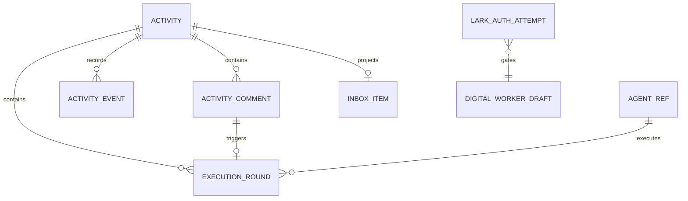

<!-- markdownlint-disable MD013 -->

# Data Model: 私人动态与执行轮次

## Design Goals

- 一个用户任务对应一条稳定的私人动态；
- 用户评论是下一轮执行的指令；
- 每轮执行可独立恢复、重试和审计；
- 第一版支持默认智能体，同时为后续多智能体保留稳定标识；
- renderer 不直接依赖 JSON 文件、Electron 或具体 AgentBus 协议。

## Entity Relationship



## Activity

私人任务动态的聚合根。

```ts
interface Activity {
  id: string;
  title: string;
  description?: string;
  status: ActivityStatus;
  defaultAgentId: string;
  latestRoundId?: string;
  createdAt: string;
  updatedAt: string;
  completedAt?: string;
  archivedAt?: string;
  source: 'desktop' | 'feishu' | 'cli' | 'migration';
  legacyTaskRef?: {
    teamName: string;
    taskId: string;
  };
}

type ActivityStatus =
  | 'queued'
  | 'running'
  | 'waiting_for_user'
  | 'completed'
  | 'failed'
  | 'cancelled'
  | 'archived';
```

### Activity Invariants

- `Activity.id` 全局稳定；
- 一个 activity 同一时间最多有一个前台 active round，除非未来显式启用并行多智能体；
- `latestRoundId` 必须属于该 activity；
- `archived` activity 不接受新评论执行，除非先恢复；
- 第一版不实现跨用户可见性，所有 activity 均为本地私人内容。

## ActivityComment

用户在动态中的评论。只有 `authorType === 'user'` 且 `intent === 'execute'` 的评论才触发下一轮。

```ts
interface ActivityComment {
  id: string;
  activityId: string;
  authorType: 'user' | 'agent' | 'system';
  authorId?: string;
  body: string;
  intent: 'execute' | 'note';
  clientMutationId?: string;
  triggeredRoundId?: string;
  createdAt: string;
  attachments?: ActivityAttachment[];
}
```

### Comment Invariants

- 相同 `activityId + clientMutationId` 只能创建一条评论；
- 一条 execute comment 最多关联一个 `triggeredRoundId`；
- agent/system comment 默认只能是 `note`；
- 空白评论不能触发执行；
- comment 与 round 的创建必须原子提交或通过可恢复 outbox 保证最终一致。

## ExecutionRound

一次独立的智能体执行。

```ts
interface ExecutionRound {
  id: string;
  activityId: string;
  ordinal: number;
  trigger: 'activity_created' | 'user_comment' | 'retry' | 'manual';
  triggerCommentId?: string;
  parentRoundId?: string;
  agentId: string;
  status: ExecutionRoundStatus;
  input: string;
  contextRef: string;
  runtimeSessionKey?: string;
  dispatchId?: string;
  startedAt?: string;
  finishedAt?: string;
  createdAt: string;
  output?: string;
  error?: RoundError;
  artifacts?: RoundArtifact[];
  idempotencyKey: string;
}

type ExecutionRoundStatus =
  | 'pending'
  | 'dispatching'
  | 'running'
  | 'waiting_for_user'
  | 'completed'
  | 'failed'
  | 'cancelled';
```

### Round Invariants

- `ordinal` 在同一 activity 内单调递增且唯一；
- `idempotencyKey` 唯一；
- comment 触发轮次时，默认 key 为 `activity:<activityId>:comment:<commentId>`；
- retry 创建新 round，不能覆盖失败 round 的历史；
- `agentId` 必须存在于 AgentRef repository 或为显式迁移占位值；
- 智能体输出事件只能更新所属 round，不能创建新 round。

## ActivityEvent

用于构建时间线的不可变事件投影。

```ts
interface ActivityEvent {
  id: string;
  activityId: string;
  roundId?: string;
  type:
    | 'activity_created'
    | 'comment_added'
    | 'round_queued'
    | 'round_started'
    | 'round_output'
    | 'round_waiting_for_user'
    | 'round_completed'
    | 'round_failed'
    | 'round_cancelled'
    | 'artifact_added';
  createdAt: string;
  payload: Record<string, unknown>;
}
```

首版可以从 activity/comment/round 数据生成 timeline，不要求立即采用完整 event sourcing。若持久化事件，事件必须 append-only。

## InboxItem

收件箱是 Activity 的派生投影，不是第二套任务源。

```ts
interface InboxItem {
  activityId: string;
  reason: 'waiting_for_user' | 'completed' | 'failed';
  unread: boolean;
  latestEventAt: string;
  acknowledgedAt?: string;
}
```

### Projection Rules

- round 进入 `waiting_for_user` → `waiting_for_user`；
- round 完成且用户未查看 → `completed`；
- round 失败且未恢复 → `failed`；
- 用户打开详情或显式确认后标记已读；
- 收件箱删除不删除 activity。

## AgentRef

第一版的轻量智能体引用，后续可扩展为多智能体。

```ts
interface AgentRef {
  id: string;
  displayName: string;
  harness: 'claudecode' | 'codex' | 'gemini' | 'cursor' | 'opencode' | string;
  status: 'available' | 'busy' | 'offline' | 'error';
  teamName?: string;
  memberName?: string;
}
```

首版仅要求默认 agent 可用，不实现一条评论并行派发多个 agent。

## LarkAuthorizationAttempt

记录桌面创建流中的飞书个人授权门禁状态，不存储明文 token。

```ts
interface LarkAuthorizationAttempt {
  id: string;
  workerDraftId: string;
  profileName?: string;
  identity: 'user';
  scopeDomain: 'all';
  status: 'checking' | 'authorizing' | 'authorized' | 'failed' | 'cancelled';
  startedAt: string;
  finishedAt?: string;
  errorCode?: string;
  errorMessage?: string;
  credentialReportStatus?: 'pending' | 'reported' | 'failed';
}
```

### Security Rules

- 不在 Activity、Comment、Round 或 renderer store 中保存 token；
- renderer 只接收授权状态和安全错误信息；
- 真实凭证只由 lark-cli profile 和受控 main-process service 管理；
- AgentBus auth token、bot/app token 不得映射为该实体的授权成功。

## Existing Model Mapping

第一版优先通过 adapter 映射现有数据，避免一次性迁移全部存储：

| New Model       | Existing Candidate                                  |
| --------------- | --------------------------------------------------- |
| Activity        | `TeamTask` / task board item                        |
| ActivityComment | `TaskComment` / structured task comment             |
| ExecutionRound  | task dispatch/session/message metadata 的新聚合记录 |
| ActivityEvent   | task activity + inbox messages + direct-cli events  |
| AgentRef        | team member / worker / harness metadata             |
| InboxItem       | Activity 状态的 renderer/server projection          |

adapter 必须保留 `TaskRef`、`messageId`、`isMeta` 和软删除语义，不能通过字符串解析重新猜测结构化引用。

## State Transitions

```text
Activity:
queued -> running -> waiting_for_user -> running -> completed
                    \-> failed -> running (retry/new comment)
queued/running/waiting_for_user -> cancelled
completed/failed/cancelled -> archived

ExecutionRound:
pending -> dispatching -> running -> waiting_for_user
                              \-> completed
                              \-> failed
pending/dispatching/running/waiting_for_user -> cancelled
```

所有非法状态变化必须在 `core/domain` 拒绝，而不是依赖 renderer 隐藏按钮。
