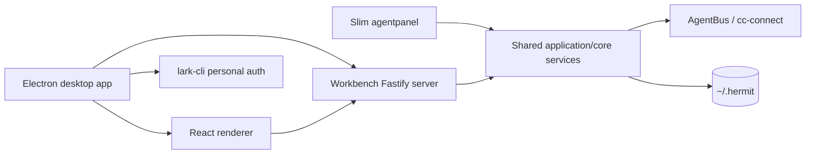

<!-- markdownlint-disable MD013 -->

# Implementation Plan: 独立私人工作台桌面应用

## Summary

将当前由 `agentpanel` 提供的 Web 工作台完整迁移为独立桌面应用，同时把 npm CLI 收缩为消息总线、用户/鉴权和 token 池三个领域。

第一版沿用当前工作台的视觉风格和 React 组件，不复制 Multica 的视觉设计。产品交互改为私人动态模型：一个任务是一条私人动态，用户评论会在同一动态中创建下一轮智能体执行。

桌面端使用 Electron，第一版同时产出 Windows x64 和 macOS arm64/x64 安装包。移除 usage telemetry，只保留创建飞书数字员工时的 lark-cli 个人 `as user` 授权及飞书授权凭证上报。

## Locked Sequence

> **硬性进入条件：必须先拆分 `src/main/server.ts`，之后才能开始桌面壳、私人动态 UI、CLI 剥离或安装包工作。**

执行顺序不可颠倒：

1. 行为保持地拆分 `src/main/server.ts`；
2. 通过类型检查、构建和聚焦回归；
3. 建立独立桌面工作台包并迁移 Web 工作台；
4. 收缩 CLI 包边界；
5. 增加私人动态、评论下一轮和收件箱投影；
6. 接入飞书 lark-cli 个人授权；
7. 产出 Windows/macOS 首版安装包。

Phase 0 未达到退出标准时，不允许并行修改工作台业务模型，以避免把结构重构和行为变更混在同一批改动中。

## Product Boundary

### Slim `agentpanel`

只保留：

- 消息总线及其必要的 teams/tasks/collaboration 命令；
- 用户与 AgentBus 鉴权；
- token 池的认领、恢复和状态操作。

移除：

- Web 工作台启动入口；
- renderer 静态资源；
- 工作台 Fastify server 生命周期；
- 数字员工 GUI 创建向导；
- usage 命令和 `__telemetry-worker`；
- usage telemetry 的后台采集、导出和上报。

CLI 不得要求桌面应用正在运行。CLI 保留领域通过共享 application service 或专用 CLI adapter 直接工作，不能继续依赖桌面应用的 localhost server。

### Desktop Workbench

独立桌面应用负责：

- 当前 Web 工作台 renderer；
- 工作台 Fastify routes 和 service composition；
- 数字员工创建、重新授权及 GUI 流程；
- 私人动态、执行轮次、评论和收件箱；
- Extensions、Skills、设置、编辑器等原有工作台页面；
- Electron 生命周期和 Windows/macOS 打包。

## Target Architecture



### Repository Shape

目标仓库形态：

```text
apps/
  workbench-desktop/
    package.json
    src/main/
    src/preload/
    electron-builder.yml

src/features/
  private-activity/
    contracts/
    core/domain/
    core/application/
    main/composition/
    main/adapters/input/
    main/adapters/output/
    main/infrastructure/
    renderer/

src/main/
  server.ts
  serverContext.ts
  routes/
    index.ts
    teams.ts
    extensions.ts
    setup.ts
    editor.ts
    schedules.ts
    systemManager.ts
    bridge.ts
    configuration.ts
    notifications.ts
    projects.ts
    workers.ts

bin/
  hermit.mjs
  lib/
```

具体目录可在 Phase 0 调研后微调，但 feature 必须遵循 `docs/FEATURE_ARCHITECTURE_STANDARD.md`，跨边界只通过 public entrypoint 引用。

## Phase 0: Split `src/main/server.ts` First

### Objective

把当前约 7,800 行、235 个 Fastify 路由的单体 `src/main/server.ts` 收缩为应用装配入口，同时保持现有 HTTP 行为、数据语义和进程生命周期不变。

Phase 0 基线材料：

- [`route-inventory.md`](route-inventory.md)：235 个 routes 全量清单与顺序约束；
- [`server-context-inventory.md`](server-context-inventory.md)：共享实例、状态和生命周期所有权；
- [`test-coverage.md`](test-coverage.md)：现有测试映射与拆分前补测缺口。

### Step 0.1: Add Baseline Tests

拆分前先确认或补充聚焦测试：

- route 注册和关键响应契约；
- teams/tasks/message 生命周期；
- bridge/direct-cli 消息路由；
- setup 与数字员工创建；
- editor 路径安全；
- extensions 路由；
- telemetry 当前行为基线，便于后续明确删除而不是意外破坏。

### Step 0.2: Create `ServerContext`

把 handler 闭包引用的共享实例收拢为单一 context，包括但不限于：

- `HermitBridgeClient`；
- `HermitBridgeConnection`；
- `HermitBridgeLauncher`；
- `TeamProvisioningService`；
- extensions services；
- `SystemManagerConfigService`；
- `WorkflowPromptService`；
- `DirectCliSessionManager`；
- `ImLiveWatcher`；
- `HermitCcSettingsService`；
- `UpdateService`；
- SSE clients、session route、permission approval 和 schedule runtime maps。

每个工作台进程只能创建一个 context。路由模块不得自行重复实例化有状态 service、watcher、bridge client 或内存缓存。

### Step 0.3: Extract Fastify Route Plugins

按业务域逐个抽取 Fastify 插件。建议顺序从小而隔离的域开始：

1. update/version/status；
2. system-manager/configuration；
3. notifications/events；
4. setup/workers；
5. editor；
6. schedules；
7. extensions；
8. teams/tasks/messages/review；
9. bridge/direct-cli；
10. telemetry（先隔离，后续阶段删除 usage 部分）。

每抽取一个域就运行聚焦测试和类型检查，不做顺手业务重构。

### Step 0.4: Separate Factory From Process Entry

最终提供：

- `createServerContext()`：创建共享依赖；
- `createWorkbenchServer(context, options)`：创建和注册 Fastify app，但不自动监听；
- `startStandaloneServer()`：现有独立进程入口；
- `shutdownWorkbenchServer()`：统一清理 watcher、bridge、direct-cli 和 Fastify。

Electron main process后续只能调用 factory，不得通过 import 触发 `listen()`。

### Phase 0 Exit Criteria

只有全部满足后才能进入下一阶段：

- `server.ts` 只保留配置、装配、启动和关闭，目标不超过约 400 行；
- 235 个现有 routes 均已登记到明确的 route module，或有书面删除决定；
- route modules 通过显式 context 获得依赖；
- 无重复 bridge/watcher/service 实例；
- `pnpm typecheck` 通过；
- `pnpm build:server` 通过；
- teams/tasks/messages、setup、extensions、editor 的聚焦测试通过；
- HTTP 路径和响应契约没有非计划变化。

## Phase 1: Extract The Desktop Workbench

### Electron Shell

Electron main process负责：

- 创建单一 `ServerContext` 和 Fastify app；
- 只监听 loopback 地址；
- 将实际 server URL 注入 renderer；
- 加载现有 Vite renderer；
- app 退出时按顺序关闭 Fastify、watcher、bridge 和子进程；
- 管理单实例、日志目录和外部链接；
- 禁用 renderer Node integration，使用 context isolation。

首版复用 HTTP transport，不要求重写为 Electron IPC。

### Renderer Strategy

第一版：

- 沿用当前 Tailwind、Radix、主题、卡片、列表、弹窗和编辑器组件；
- 不复制 Multica 视觉风格；
- 不重做 Extensions、Skills、设置、编辑器等二级页面；
- 只围绕私人动态主流程调整导航和核心页面；
- 新 UI 可见文案优先使用简体中文。

## Phase 2: Private Activity Model

### Core Semantics

- 一个用户任务对应一个 `Activity`；
- 每次智能体执行对应一个 `ExecutionRound`；
- 用户评论在同一事务/幂等操作中创建 `Comment` 和下一轮 `ExecutionRound`；
- 智能体输出、系统日志和状态事件不会自动触发下一轮；
- 新轮次默认继承 activity 上下文和上一轮智能体；
- 每轮必须独立保存输入、状态、输出、错误和产物引用；
- app 重启后不得重复执行已入队的评论；
- 第一版允许一个默认智能体，但模型必须保留 `agentId`，后续可指派不同智能体。

### Primary UI

第一版核心页面：

1. 私人动态列表；
2. 发布任务；
3. 动态详情和轮次时间线；
4. 评论输入框；
5. 收件箱投影：等待用户、执行完成、执行失败；
6. 智能体状态和选择入口；
7. 设置与飞书授权。

## Phase 3: Feishu Personal Authorization

当用户在创建数字员工时选择飞书：

1. 检测 lark-cli；
2. 明确提示将进行个人用户授权；
3. 使用真实 lark-cli profile，以 `as user` 和完整 `--domain all` 作用域发起或刷新授权；
4. 展示授权进行中、成功、失败、取消和重试状态；
5. 授权失败时阻止飞书数字员工创建继续提交；
6. 授权成功后仅执行飞书授权凭证上报。

不得使用 bot/app token、AgentBus `auth login` token 或其他身份代替个人 `as user` 凭证。

## Phase 4: Slim CLI And Remove Usage Telemetry

- 删除 CLI 工作台启动入口及对 renderer/server 资源的打包；
- 删除 usage CLI 入口和 `__telemetry-worker`；
- app 不初始化 usage telemetry；
- 删除或停用 usage status/export/report routes 和后台 worker；
- 保留飞书个人授权凭证上报；
- npm 包不包含 desktop renderer、Electron runtime 或 desktop installers；
- 桌面应用作为独立发行物发布。

## Phase 5: Windows And macOS Packaging

首版目标：

- Windows x64 安装包；
- macOS arm64 安装包；
- macOS x64 安装包；
- CI matrix 独立在对应 OS 构建；
- 安装后无需先启动 CLI 工作台；
- app 能发现所需 runtime/lark-cli，并给出中文错误和恢复指引。

第一版可先提供未签名安装包。代码签名、公证和自动更新不阻塞首版。

## Verification Strategy

### Phase 0

```bash
pnpm typecheck 2>&1 | tail -20
pnpm build:server 2>&1 | tail -20
pnpm test -- <focused-server-and-route-tests> 2>&1 | tail -20
```

### Desktop

- Electron main lifecycle tests；
- app factory 单实例测试；
- loopback binding 和 origin 校验；
- renderer smoke：启动、加载动态列表、进入设置；
- Windows/macOS CI build smoke；
- app 关闭后无残留 server、bridge 或 watcher 进程。

### Private Activity

- 创建 activity 后产生 Round 1；
- 用户评论恰好产生一个下一轮；
- 重复请求不会创建重复 round；
- agent/system output 不会产生下一轮；
- app 重启后 round 状态恢复；
- 失败轮次可重试但保留历史。

### Feishu

- 非飞书渠道不触发 lark-cli 授权；
- 飞书渠道必须完成个人 `as user --domain all` 授权；
- 授权失败时创建流程停止；
- 成功后触发飞书凭证上报；
- 不触发 usage telemetry。

## Estimated Schedule

一个开发，第一版目标约三周，第四周作为跨平台和回归缓冲：

| Workstream                        |     Estimate |
| --------------------------------- | -----------: |
| Phase 0：拆分 `server.ts`         | 5–7 个工作日 |
| Phase 1：工作台迁移与 Electron 壳 | 3–5 个工作日 |
| Phase 2：私人动态和评论下一轮     | 4–6 个工作日 |
| Phase 3：飞书个人授权             | 2–3 个工作日 |
| Phase 4–5：CLI 收缩、打包、回归   | 3–5 个工作日 |

工作可在 Phase 0 完成后部分并行；总日历时间目标为 2.5–3 周，对外按 3 周计划，预留第 4 周处理 Windows/macOS 差异和阻断性回归。

## Risks And Mitigations

| Risk                        | Mitigation                                                      |
| --------------------------- | --------------------------------------------------------------- |
| server 拆分导致共享状态重复 | 单一 `ServerContext`；route module 禁止实例化有状态依赖         |
| 结构重构和行为变化混杂      | Phase 0 硬门禁；先保持行为，后改产品模型                        |
| CLI 仍依赖桌面 server       | 为三个保留领域提供共享 application service/CLI adapter          |
| 评论重复触发执行            | client mutation id、持久化幂等键和原子 comment+round 创建       |
| Electron 退出残留进程       | 明确 lifecycle owner 和可测试 shutdown 顺序                     |
| Windows/macOS PATH 差异     | runtime discovery service，不依赖交互 shell 的 PATH 刷新        |
| 错删飞书授权上报            | usage telemetry 和 Lark credential reporting 使用独立模块与测试 |
| 过早实现多智能体            | 第一版只预留 `agentId` 和指派接口，不实现并行编排               |

## Out Of Scope For First Release

- Multica 视觉风格复刻；
- 完整多智能体并行编排；
- 多用户权限和公开动态；
- 云端同步；
- 代码签名、公证和自动更新；
- 全量重做 Extensions、Skills、设置和编辑器 UI；
- usage telemetry、usage worker、usage 导出和上报。
